[IoT](https://img.shields.io/badge/IoT-blue)     

> Turn raw sensor noise into cryptographically secure random numbers, verified by blockchain and visualized in real time.

---

## Acknowledgements

Built by **Team TU Ankaja** for the IEEE MYOSA Innovation Challenge, organized by the **IEEE Sensors Council**. We would like to thank the MYOSA organizers and IEEE Sensors Council for providing the MYOSA development platform and the opportunity to explore true random number generation. We also acknowledge the guidance and support provided by our mentor **Dr. Rupam Goswami**, Professor, Department of ECE, Tezpur University, throughout this project.

**Team Members:**

| Name | Department | Role |
|------|-----------|------|
| Yash Sharma | B.Tech 4th Semester, ECE | Lead Developer — Rust backend, MQTT pipeline, blockchain integration, frontend dashboard |
| Nautesh Kanojiya | B.Tech 4th Semester, ECE | Hardware Design — MOSFET noise circuit, chaotic box construction, sensor wiring |
| Nabajyoti Das | B.Tech 4th Semester, ECE | Firmware — ESP32 MQTT publisher, sensor data collection, BCD clamping logic |
| Hritima Rabha | B.Tech 4th Semester, ECE | Testing & Documentation — Integration tests, README, demo scripts |

---

## Overview

**TU Ankaja** is an innovative hardware-software system designed to generate true random numbers by combining natural stochastic electronic noise with unpredictable physical parameters.

**What problem does it solve?**
- Overcomes the predictability of purely algorithmic pseudo-random number generators.
- Provides a **low analog computational cost** solution for capturing random electronic fluctuations.
- Serves as a customized hardware source for true randomness, perfectly **tailored for low-to-moderate priority security applications.**

**Key Features:**
* **Analog Noise Generation:** Utilizes an IRF540N n-channel MOSFET as a switch to generate high-frequency noise signals.
* **Multi-Sensor Aggregation:** Captures physical parameters like Electronic noise using MOSFET, RGB light, ambient light, temperature, gyroscope data (in x, y, z), air particles, simultaneously.
* **Custom Chaotic Environment:** Employs a physical mirrored box with rotating LEDs, moving discs, and agitated air particles to create a highly dynamic sensory input.
* **Bit-Picking Algorithm:** Uses an array-based system to process sensor data into true random numbers.

---

## Demo / Examples

### Images

<p align="center">
  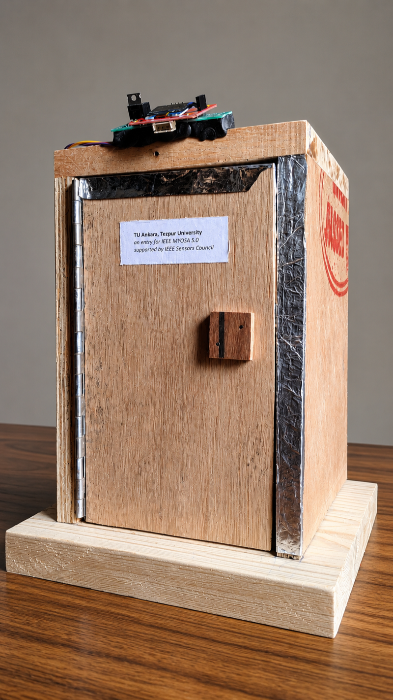<br/>
  <i>TU Ankaja — the chaotic box exterior. Label reads "TU Ankaja, Tezpur University — IEEE MYOSA 5.0"</i>
</p>

<p align="center">
  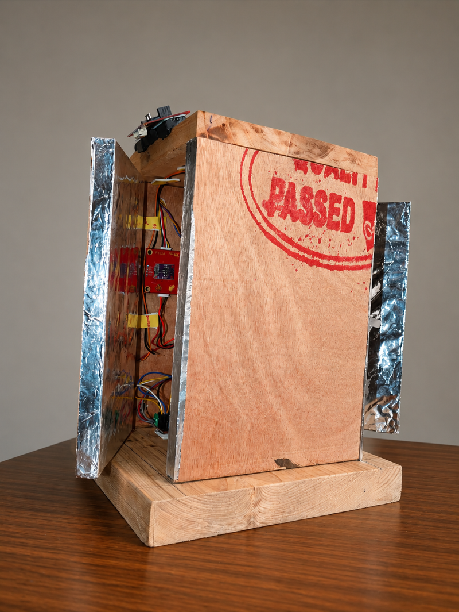<br/>
  <i>Side view with door open — mirrored interior walls visible, sensors and wiring inside</i>
</p>

<p align="center">
  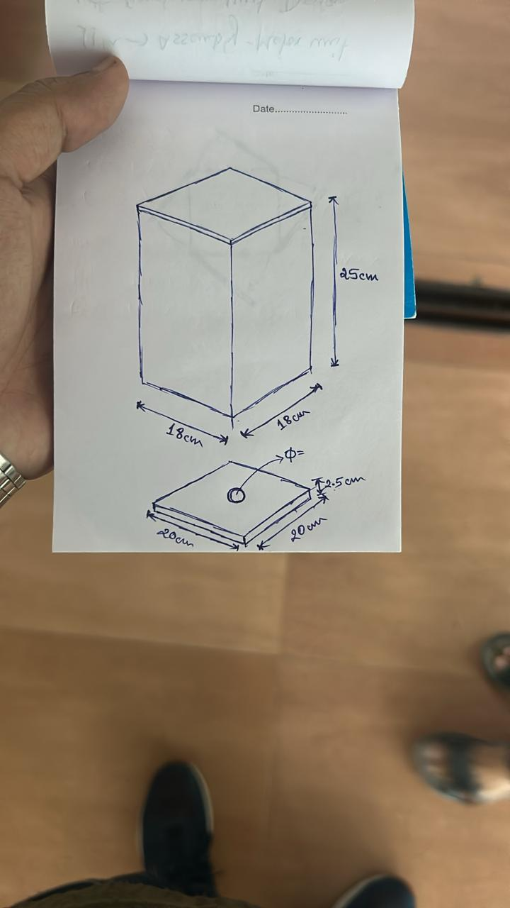<br/>
  <i>Hand-drawn design sketch — box dimensions: 18x18x25 cm, base: 20x20x2.5 cm</i>
</p>

<p align="center">
  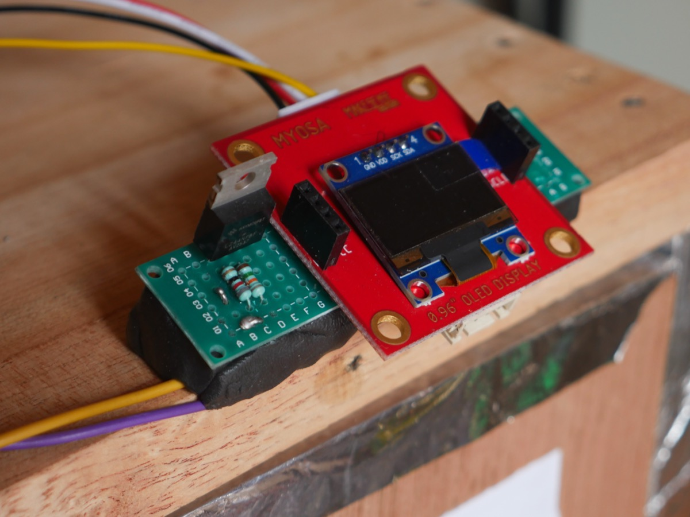<br/>
  <i>Close-up of the MOSFET noise circuit on perfboard (2k ohm pull-up + 82 ohm gate resistor) mounted on the MYOSA motherboard with 0.96" OLED display</i>
</p>

<p align="center">
  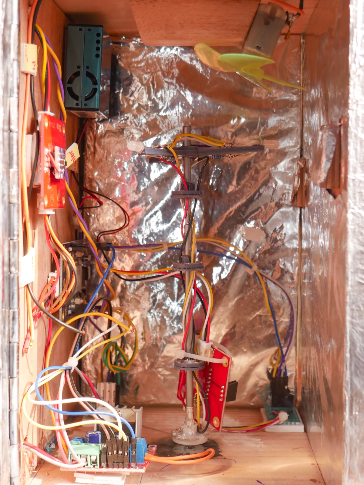<br/>
  <i>Inside the chaotic box — mirror foil, motor shaft with spinning disc, PMS5003 particle sensor (blue, top-left), MYOSA modules (red PCBs)</i>
</p>

<p align="center">
  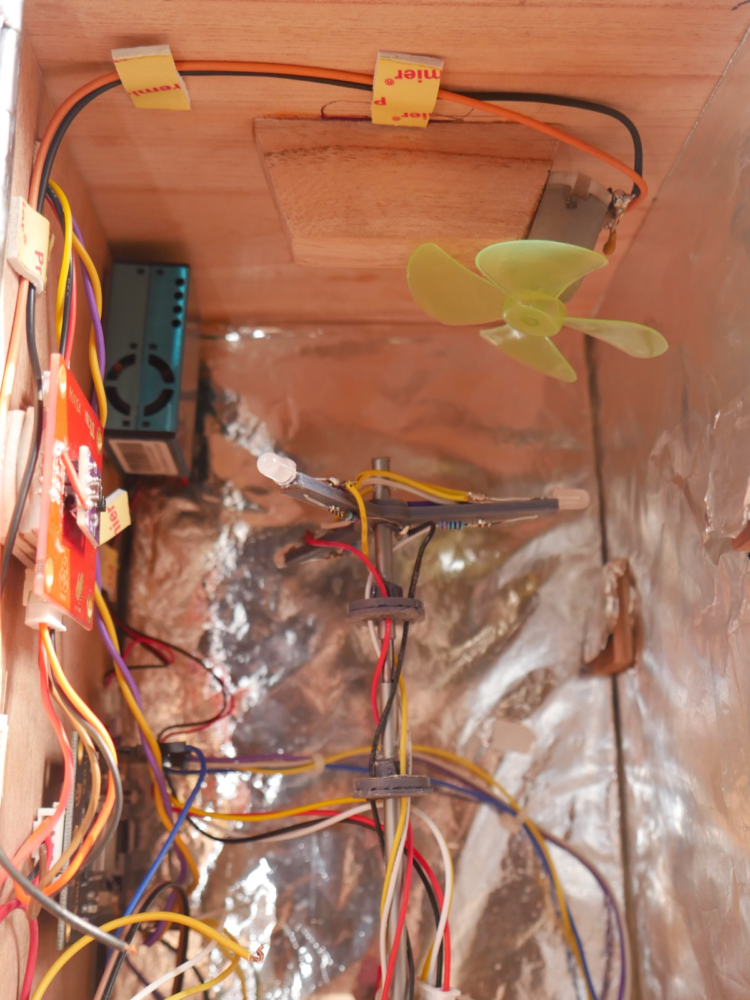<br/>
  <i>Fan blade for particle agitation — blows air across the PMS5003 sensor to generate unpredictable particle readings</i>
</p>

<p align="center">
  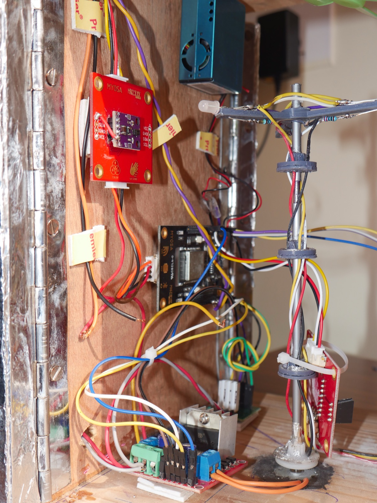<br/>
  <i>MYOSA Light/Proximity module (APDS9960, red PCB on wall), motor shaft with LED disc, and sensor wiring harness</i>
</p>

<p align="center">
  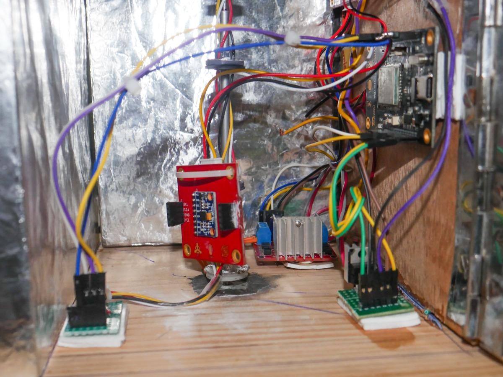<br/>
  <i>Bottom of chaotic box — MYOSA accelerometer/gyroscope module, BMP180 temperature sensor (blue PCB), and MOSFET perfboard with resistors</i>
</p>

<p align="center">
  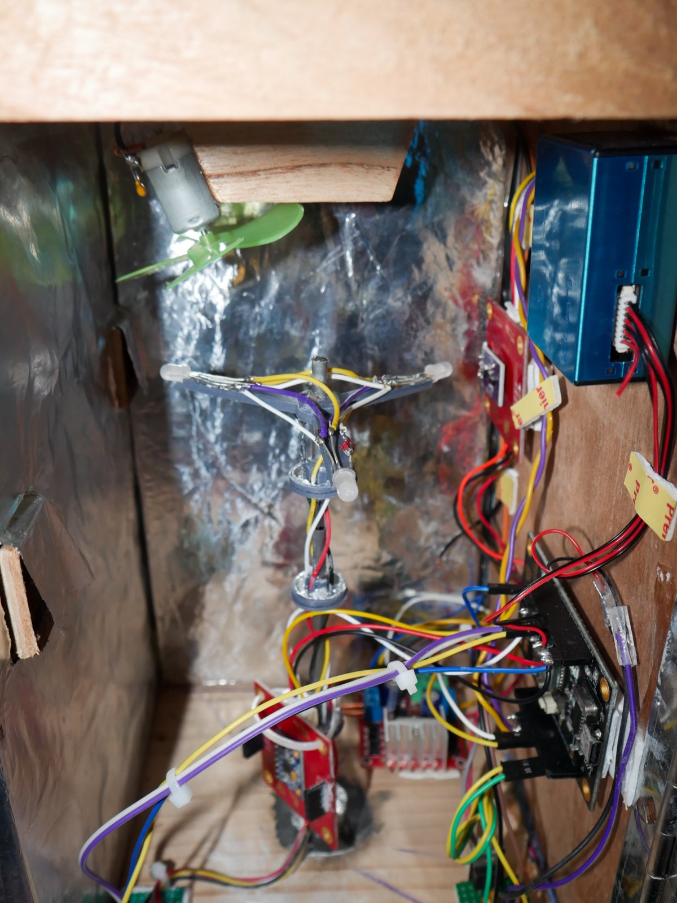<br/>
  <i>Motor assembly with rotating disc and colored LEDs for visual disturbance of the APDS9960 sensor</i>
</p>

<p align="center">
  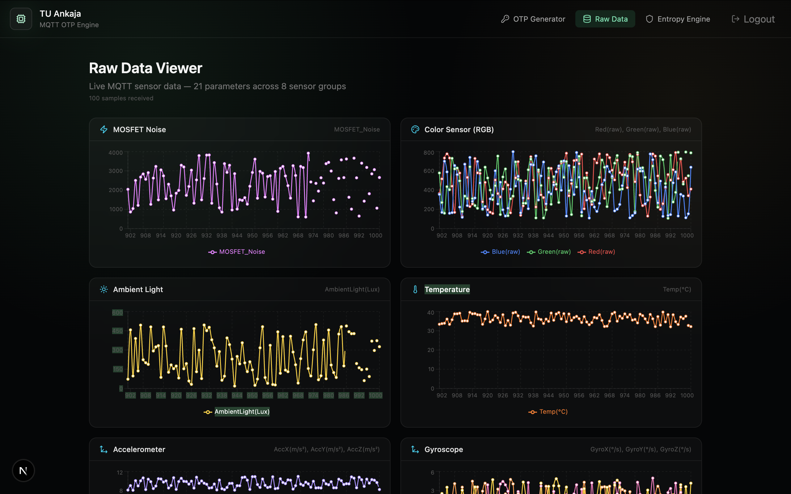<br/>
  <i>Raw Data Viewer — live MQTT sensor graphs for MOSFET noise, color, ambient light, temperature, accelerometer, and gyroscope across 21 channels</i>
</p>

<p align="center">
  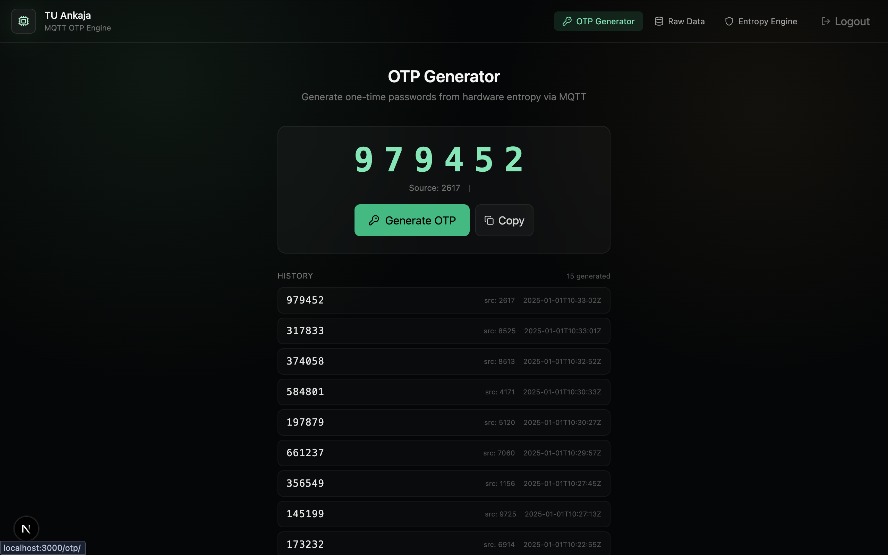<br/>
  <i>OTP Generator — hardware-backed one-time passwords generated from MOSFET noise + SHA-256, with generation history</i>
</p>

### Videos

<video controls width="100%">
  <source src="myosa-demo.mp4" type="video/mp4">
</video>

---

## Features (Detailed)

### **1. Analog Noise Generator Circuit**

Electronic noise in MOSFETs is naturally stochastic. Circuit Design: The Drain (D) terminal is connected to +3.3V using a 2k ohm pull-up resistor. Input: A random value from 0 to 255 using `dacWrite(25, esp_random() & 0xFF)` function is applied at the Gate (G) from the DAC pin 25 of MYOSA Motherboard through a small gate resistor 82 ohm. Output: The resulting random signal is harvested from the Drain terminal and fed directly to the 12-bit ADC pin 32 of the MYOSA motherboard.

```
    +3.3V
      |
     [2k ohm]  <- Pull-up resistor
      |
      +-------- ADC Pin 32 (MYOSA) <- Output: random noise signal
      |
    Drain
      |
   [IRF540N]  <- N-channel MOSFET
      |
    Gate
      |
     [82 ohm] <- Gate resistor
      |
    DAC Pin 25 (MYOSA) <- Input: dacWrite(25, esp_random() & 0xFF)
      |
    Source
      |
     GND
```

**ESP32 Project Pinout:**

| Component / Function | ESP32 Pin |
|---|---|
| DAC output / MOSFET Gate input | GPIO 25 |
| ADC input / MOSFET Drain output | GPIO 32 |
| Motor Driver ENB | GPIO 23 |
| Motor Driver IN3 | GPIO 26 |
| Motor Driver IN4 | GPIO 27 |
| LED 1 | GPIO 5 |
| LED 2 | GPIO 18 |
| LED 3 | GPIO 19 |
| UART Tx (PMS5003) | GPIO 16 |
| UART Rx (PMS5003) | GPIO 17 |
| I2C SDA | GPIO 21 |
| I2C SCL | GPIO 22 |

### **2. Chaotic Hardware Environment**

To gather unpredictable digital data, a 45 cm x 45 cm box with a rough mirrored inner wall houses multiple stimuli:

- **Visual Disturbance:** A motor rotates colored LEDs and sweeps a disc around the APDS9960 sensor to trigger random RGB and gesture data.
- **Particle Agitation:** A PC fan continuously blows air inside the box, scattering particles for the PMS5003 sensor to detect.
- **Environmental Metrics:** External BMP180 and CCS811 sensors gather ambient temperature, pressure, humidity, and volatile organic compounds to add extra environmental entropy.

### **3. Digital Processing & BCD Clamping**

- **Data Collection:** Sensors communicate via I2C and UART (PMS5003), sending 8-bit digital data packets.
- **Array Initialization:** The system accumulates two sets of 8-bit data into a 16-bit variable for each sensor.
- **Random Bit Selection:** A software "BitPicker" randomly selects bits from across the sensor arrays.
- **BCD Clamping:** The 16 random bits are grouped, and a modulo operator (%10) limits the decimal equivalent of the chunks to 9 (preventing hex values up to 15), finalizing the 16-bit random output.

### **4. Wireless Data Pipeline (MQTT)**

We use Eclipse Mosquitto as the MQTT broker. The ESP32 samples all 21 sensors, packs readings into CSV, and publishes over WiFi:

```plaintext
ESP32 (MYOSA sensors)
    | WiFi
    v
Mosquitto Broker (laptop, port 1883)
    | 3 topics: random/numbers, random/params, random/MAC
    v
Rust Backend (subscriber)
    | HTTP API (port 3001)
    v
Next.js Dashboard (port 3000)
```

MQTT gives us reliable, low-latency message delivery. The broker requires username/password authentication, so unauthorized devices cannot connect. QoS level 1 ensures no entropy samples are silently dropped.

### **5. Blockchain Device Authentication (MultiChain)**

This is the core security feature. Anyone who knows the MQTT credentials could connect a fake device and publish garbage data. So we put the trust anchor on a blockchain.

1. An administrator registers valid device MAC addresses on a MultiChain blockchain stream called `valid-macs`
2. When an ESP32 connects and publishes to `random/MAC` with `{"mac":"4C:C3:82:36:81:04"}`, the backend receives it
3. The Rust engine calls MultiChain's JSON-RPC API (`liststreamkeyitems`) to check if this MAC exists on-chain
4. If the MAC is found: the device is trusted, all random numbers are accepted
5. If the MAC is NOT found: every single random number from that device is rejected and discarded

The blockchain is immutable. Once a MAC is registered, the record cannot be tampered with.

### **6. OTP Generation**

One-time passwords are generated by combining a hardware random number with a microsecond timestamp:

```plaintext
OTP = SHA-256(random_number_bytes || timestamp_bytes) mod 1,000,000
```

This produces a 6-digit code. The random number comes from MOSFET noise (not pseudo-random), and the timestamp adds uniqueness even if the same number appears twice.

### **7. Real-Time Dashboard (Next.js)**

Three pages, each serving a different purpose:

- **OTP Generator** - Generate hardware-backed OTPs with one click. Shows source number, timestamp, and history.
- **Raw Data Viewer** - Live sensor graphs for all 8 sensor groups, updating every 3 seconds.
- **Cryptographic Dashboard** - Pool entropy bits, source quality tiers, health status, security event feed. Generate AES-256 keys, passwords, and session tokens on demand.

### **8. Entropy Source Quality Tiers**

The engine classifies each sensor source into quality tiers based on entropy contribution and health test pass rate:

| Tier | Entropy Bits | Health Pass Rate | Sources |
|------|-------------|------------------|---------|
| **Excellent** | >= 7.5 bits/byte | > 99% | MOSFET noise (primary) |
| **Good** | 5.0 - 7.5 bits/byte | > 95% | Accelerometer, Gyroscope, Particle sensor |
| **Fair** | 2.0 - 5.0 bits/byte | > 90% | RGB color, Ambient light, Temperature |
| **Poor** | < 2.0 bits/byte | < 90% | Rejected — not mixed into pool |

Sources classified as **Poor** are flagged in the security event feed and excluded from the entropy pool. The dashboard displays real-time tier assignments for all active sources.

### **9. MYOSA Libraries & Modules Used**

| MYOSA Module | Library / Interface | Purpose |
|---|---|---|
| MYOSA Motherboard (ESP32) | `WiFi.h`, `PubSubClient.h`, DAC (`dacWrite`), ADC (`analogRead`) | WiFi connectivity, MQTT publishing, MOSFET gate drive, noise sampling |
| MYOSA Accelerometer/Gyroscope | `Wire.h` (I2C, address `0x68`) | 6-axis motion data (accel x/y/z, gyro x/y/z) for entropy mixing |
| MYOSA Light/Proximity (APDS9960) | `SparkFun_APDS9960.h` (I2C) | RGB color values and ambient light intensity |
| MYOSA OLED Display | `Adafruit_SSD1306.h` (I2C) | On-device status display |
| PMS5003 Particle Sensor | UART (`Serial2`) | PM1.0, PM2.5, PM10 particle concentration readings |
| BMP180 | `Adafruit_BMP085.h` (I2C) | Temperature and barometric pressure |

> **Note:** The PMS5003 and BMP180 are external sensors not included in the standard MYOSA kit. They were added to increase the number of independent entropy sources from 4 to 8 sensor groups (21 total channels).

### **10. Hardware Deviations from Original MYOSA Kit**

| Change | Reason |
|--------|--------|
| Added external IRF540N MOSFET circuit on breadboard | MYOSA kit does not include a dedicated analog noise source. The MOSFET's stochastic drain noise provides the primary entropy source with ~7.8 bits/byte. |
| Added PMS5003 particle sensor via UART | Increases entropy diversity. Air particle counts are physically unpredictable and add an independent randomness channel. |
| Added BMP180 temperature/pressure sensor | Provides environmental entropy. Temperature fluctuations inside the chaotic box contribute additional unpredictability. |
| Built 45x45 cm chaotic box with mirror foil | Creates a controlled but unpredictable environment — motor-driven LEDs, fan-blown particles — to maximize sensor variance. |
| Used DAC pin 25 -> Gate resistor (82 ohm) -> MOSFET Gate | The MYOSA DAC output drives the MOSFET gate with a random voltage (0-255), creating variable drain current and noise. |

### **11. System Block Diagram**

```plaintext
CHAOTIC BOX (45x45 cm)
  [IRF540N MOSFET Noise] --ADC--> ESP32
  [APDS9960 RGB+Light]   --I2C--> ESP32
  [PMS5003 Particle]     --UART-> ESP32
  [MPU6050 + BMP180]     --I2C--> ESP32
                                    |
                              WiFi (MQTT, 500ms)
                                    v
                          Mosquitto Broker (port 1883)
                            3 topics: random/numbers, random/params, random/MAC
                                    |
                                    v
                          Rust Backend
                            -> Blockchain Validator (MultiChain MAC check)
                            -> SHA-256 Whitening
                            -> Entropy Pool (256-bit) + SP 800-90B Health
                            -> ChaCha20 DRBG (Forward Secrecy)
                            -> Security Gate (OTP / AES Key Gen)
                                    |
                              HTTP API (port 3001)
                                    v
                          Next.js Dashboard (port 3000)
                            [OTP Gen] [Raw Data] [Entropy Engine]
```

---

## Usage Instructions

### Starting the Full Wireless Pipeline

1. Flash the ESP32 with the MQTT firmware:

```plaintext
cd firmware/mqtt
# Open entropy_mqtt.ino in Arduino IDE
# Update WIFI_SSID, WIFI_PASS, MQTT_SERVER
# Flash to ESP32
```

2. Start the Mosquitto MQTT broker:

```plaintext
mosquitto -d
```

3. Set up MultiChain for device authentication (first time only):

```plaintext
chmod +x scripts/setup_multichain.sh
./scripts/setup_multichain.sh
```

4. Register your ESP32's MAC address on the blockchain:

```plaintext
docker exec entropy-multichain multichain-cli entropy-chain \
  publish valid-macs "4C:C3:82:36:81:04" \
  '{"json":{"mac":"4C:C3:82:36:81:04","status":"valid"}}'
```

5. Start the Rust backend:

```plaintext
./scripts/start-wireless.sh
```

Or manually with environment variables:

```plaintext
cd entropy-engine
ENTROPY_MODE=otp \
  MQTT_HOST=<your-broker-ip> \
  MQTT_PORT=1883 \
  MQTT_USER=<your-mqtt-username> \
  MQTT_PASS=<your-mqtt-password> \
  MULTICHAIN_RPC_URL=http://localhost:6740 \
  MULTICHAIN_RPC_USER=multichainrpc \
  MULTICHAIN_RPC_PASS=<your-rpc-password> \
  cargo run
```

6. Start the frontend dashboard:

```plaintext
cd frontend
npm install
npm run dev
```

7. Open `http://localhost:3000` in your browser.

### Running Without Hardware (Simulation)

If you do not have the ESP32 or MYOSA board, you can test with the simulator:

```plaintext
# Terminal 1: Start Mosquitto
mosquitto -d

# Terminal 2: Run the MQTT simulator
python3 scripts/mqtt_simulator.py

# Terminal 3: Start the engine in MQTT mode
cd entropy-engine
ENTROPY_MODE=mqtt cargo run

# Terminal 4: Start the dashboard
cd frontend && npm run dev
```

### Running the Firmware Simulator (No WiFi needed)

```plaintext
cd firmware
make run
```

This compiles and runs the C entropy simulator locally, printing a sample of generated entropy bytes.

---

## Tech Stack

* **ESP32 (MYOSA Motherboard)** - Microcontroller with built-in WiFi for wireless sensor data transmission
* **MYOSA Sensor Board** - 21-channel multi-sensor board (MOSFET noise, IMU, color, light, particle sensor)
* **IRF540N MOSFET** - N-channel MOSFET for analog noise generation (primary entropy source)
* **APDS9960** - RGB and ambient light sensor module
* **PMS5003** - Particle matter sensor for air quality readings
* **C** - Firmware for ADC noise reading and entropy mixing with avalanche function
* **Arduino (PubSubClient)** - MQTT client library for ESP32 WiFi publishing
* **Rust** - Backend with SHA-256 whitening, ChaCha20 DRBG, health monitoring, and HTTP API
* **rumqttc** - Rust MQTT client for subscribing to broker topics
* **axum** - Rust HTTP framework serving the REST API
* **Eclipse Mosquitto** - MQTT broker with username/password authentication
* **MultiChain** - Private blockchain for device MAC address validation (Docker)
* **Next.js 16** - React framework for the dashboard frontend
* **Recharts** - Charting library for real-time sensor data visualization
* **Framer Motion** - Animation library for smooth UI transitions
* **Zustand** - Lightweight state management for React
* **Tailwind CSS v4** - Utility-first CSS framework

---

## Requirements / Installation

### Hardware Requirements

- MYOSA Motherboard (ESP32-based)
- MYOSA OLED Display
- MYOSA Accelerometer/Gyroscope Module
- MYOSA Light/Proximity Module (APDS9960)
- Particle Sensor (PMS5003)
- IRF540N n-channel MOSFET
- 2k ohm pull-up resistor, 82 ohm gate resistor
- Breadboard and jumper wires

### Software Requirements

- Rust toolchain (1.70+)
- Node.js (18+)
- Python 3 (for MQTT simulator)
- Docker Desktop (for MultiChain blockchain)
- Arduino IDE (for flashing ESP32)

### Dependencies

Rust engine:

```plaintext
cd entropy-engine
cargo build
```

Frontend:

```plaintext
cd frontend
npm install
```

Python simulator:

```plaintext
pip install paho-mqtt
```

MQTT broker:

```plaintext
brew install mosquitto
```

### Quick Check (All Components)

```plaintext
./scripts/check-all.sh
```

This runs the firmware simulator, Rust tests (96 tests), and frontend type checking.

---

## File Structure

```
/tu-ankaja
  ├── assets/
  │   ├── box-exterior-front.png
  │   ├── box-exterior-side.png
  │   ├── mosfet-circuit-closeup.jpeg
  │   ├── chaotic-box-inside-full.jpeg
  │   ├── chaotic-box-fan.jpeg
  │   ├── chaotic-box-sensors.jpeg
  │   ├── chaotic-box-bottom.jpeg
  │   ├── chaotic-box-motor.jpeg
  │   └── box-dimensions.jpg
  │
  ├── firmware/
  │   ├── src/
  │   │   ├── main.c
  │   │   ├── adc/adc.c
  │   │   ├── sensors/sensors.c
  │   │   ├── entropy/entropy.c
  │   │   └── uart/uart.c
  │   ├── include/entropy_vault.h
  │   ├── mqtt/entropy_mqtt.ino
  │   └── Makefile
  │
  ├── entropy-engine/
  │   ├── src/
  │   │   ├── main.rs
  │   │   ├── lib.rs
  │   │   ├── api/mod.rs
  │   │   ├── whitening/mod.rs
  │   │   ├── pool/mod.rs
  │   │   ├── drbg/mod.rs
  │   │   ├── health/mod.rs
  │   │   ├── quality/mod.rs
  │   │   ├── security/mod.rs
  │   │   ├── crypto/mod.rs
  │   │   ├── mqtt/mod.rs
  │   │   ├── otp/mod.rs
  │   │   ├── otp_mqtt/mod.rs
  │   │   ├── blockchain/mod.rs
  │   │   ├── server/mod.rs
  │   │   ├── parser/mod.rs
  │   │   ├── serial/mod.rs
  │   │   ├── models/mod.rs
  │   │   └── errors/mod.rs
  │   ├── tests/engine.rs
  │   └── Cargo.toml
  │
  ├── frontend/
  │   ├── app/
  │   │   ├── page.tsx
  │   │   ├── otp/page.tsx
  │   │   ├── data/page.tsx
  │   │   ├── entropy/page.tsx
  │   │   └── layout.tsx
  │   ├── components/
  │   ├── services/
  │   ├── store/
  │   ├── types/
  │   └── package.json
  │
  ├── scripts/
  │   ├── start-wireless.sh
  │   ├── setup_multichain.sh
  │   ├── blockchain
  │   ├── demo-blockchain.sh
  │   ├── mqtt_simulator.py
  │   ├── otp_simulator.py
  │   ├── check-all.sh
  │   ├── flash-esp32.sh
  │   └── start_all.sh
  │
  ├── myosa-demo.mp4
  └── LICENSE
```

---

## License

MIT License. See the LICENSE file for full text.

---

## Contribution Notes

This project is open source. If you want to contribute:

1. Fork the repository
2. Create a feature branch
3. Run `./scripts/check-all.sh` to make sure everything passes
4. Submit a pull request

Areas where contributions would be useful:

- Adding TLS/mTLS support for encrypted MQTT connections
- Implementing HMAC challenge-response for stronger device authentication
- Adding more entropy health tests (e.g., NIST SP 800-22 test suite)
- Mobile app for monitoring the dashboard remotely
